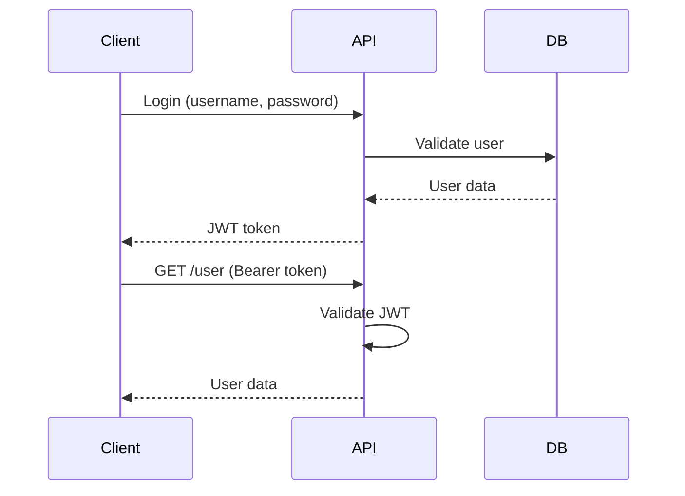

# Design Doc Writing — Texniki Dizayn Sənədi

## Səviyyə
B1-B2 (senior interview)

---

## Niyə Vacibdir?

Design doc = texniki yazılı təklif. Bəzi böyük tech şirkətlərdə (Google, Meta, Amazon) normal iş axınıdır.

- Planlaşdırmanı sənədləşdirir
- Fikir alışverişi
- Tarixi qeyd
- Senior səviyyə bacarıq

**Yaxşı design doc = yaxşı arxitektor imza**

---

## Design Doc Strukturu

```markdown
# Title

## TL;DR
(1 cümlə: nə təklif edirsən)

## Context / Background
(Problem və mövcud vəziyyət)

## Goals
(Nə istəyirsən nail olasan)

## Non-goals
(Nə DEYİL — scope sərhədləri)

## Proposed Solution
(Təklif — əsas bölmə)

## Alternatives Considered
(Başqa variantlar və niyə rədd edildi)

## Trade-offs
(Artı və əksikliklər)

## Timeline / Milestones
(Cədvəl)

## Open Questions
(Hələ qərar verilməyən məsələlər)
```

---

## 1. Title

Aydın, spesifik. Qərar şəklində.

### ✓ Good

- "Migrate Authentication to JWT"
- "Add Caching Layer with Redis"
- "Refactor User Service for Scale"

### ✗ Bad

- "Auth Changes"
- "Redis"
- "Improvements"

---

## 2. TL;DR

"Too Long; Didn't Read" — bir cümləlik yekun.

### ✓ Yaxşı

```
## TL;DR
We propose migrating session-based authentication to JWT
to enable horizontal scaling and stateless APIs.
```

### ✗ Pis

```
## TL;DR
This doc is about authentication.
```

---

## 3. Context / Background

**Problem nədir?** **Niyə bunu müzakirə edirik?**

### Template

```markdown
## Context

### Current State
[Hazırda necə işləyir]

### Problem
[Nə problem yarandı]

### Impact
[Bu problemin təsiri]
```

### Nümunə

```markdown
## Context

### Current State
Our API uses PHP session authentication stored in Redis.
Each request looks up the session from Redis.

### Problem
- High latency: 50ms per request for session lookup
- Redis memory growing 10GB/month
- Stateful — hard to scale across regions

### Impact
- User experience: slow API responses
- Cost: Redis cluster costs $5k/month
- Engineering: blocks multi-region deployment
```

---

## 4. Goals / Non-goals

### Goals — Nail olunacaq

```markdown
## Goals
- Reduce auth latency to <5ms
- Support stateless authentication
- Enable multi-region deployment
- Reduce infrastructure costs by 30%
```

### Non-goals — Scope kənarı

```markdown
## Non-goals
- Rewriting user management
- Adding OAuth providers (future work)
- Changing password hashing
```

**Non-goals niyə vacib?** Reviewer-in diqqəti yayınmasın deyə.

---

## 5. Proposed Solution

Əsas bölmə. **Necə edəcəyik?**

### Alt başlıqlar

```markdown
## Proposed Solution

### Overview
[Yüksək səviyyə təsvir]

### Architecture
[Diagram / schema]

### Implementation Details
[Texniki detallar]

### API Changes
[Endpoint dəyişikliyi]

### Database Changes
[Schema]

### Migration Plan
[Köhnədən yeniyə keçid]
```

### Nümunə

```markdown
## Proposed Solution

### Overview
Replace session lookup with JWT validation. Tokens are
signed with RS256 and contain user_id + roles. No server
state needed for auth.

### Architecture

[Client] → [API Gateway] → [JWT Validator] → [Service]
              ↓
         [Public Key Cache]

### Implementation

1. New `/api/login` endpoint returns JWT
2. Middleware validates JWT on each request
3. Public keys cached in memory (rotated daily)

### API Changes

**Before:**
```http
POST /login → Set-Cookie: session=abc
```

**After:**
```http
POST /api/login → {token: "eyJ..."}
GET /api/user (Authorization: Bearer eyJ...)
```
```

---

## 6. Alternatives Considered

**Niyə başqa yolları seçmədik?**

### Şablon

```markdown
## Alternatives Considered

### Alternative 1: OAuth 2.0
**Pros**: Industry standard, 3rd party auth possible
**Cons**: Overkill for our needs, complex setup
**Decision**: Rejected — simpler JWT is sufficient

### Alternative 2: Improve current session system
**Pros**: No migration needed
**Cons**: Doesn't solve scalability
**Decision**: Rejected — fundamental issue

### Alternative 3: PASETO tokens
**Pros**: More secure than JWT
**Cons**: Less ecosystem support
**Decision**: Rejected — JWT enough for our threat model
```

---

## 7. Trade-offs

Hər qərarın qiyməti var.

```markdown
## Trade-offs

### Pros
- Stateless — easy to scale
- Fast validation (no Redis call)
- Standard (widely supported)

### Cons
- Token revocation is harder
- Larger request headers
- Need to manage key rotation

### Mitigations
- Short token expiry (15 min)
- Refresh token pattern
- Automated key rotation
```

---

## 8. Timeline / Milestones

```markdown
## Timeline

### Phase 1 (Week 1-2): Foundation
- Implement JWT signer / validator
- Add unit tests
- Internal review

### Phase 2 (Week 3-4): Migration
- New login endpoint alongside old
- Gradual client migration
- Monitoring + rollback plan

### Phase 3 (Week 5-6): Cleanup
- Remove session code
- Remove Redis dependency
- Documentation update

### Target: End of Q2
```

---

## 9. Open Questions

Hələ qərar verilməyən məsələlər.

```markdown
## Open Questions

1. **Token storage**: localStorage vs httpOnly cookies?
   (Security vs convenience trade-off)

2. **Refresh token lifetime**: 7 days vs 30 days?

3. **Key rotation schedule**: Daily vs weekly?

Input welcome from @security-team and @frontend-team.
```

---

## Common Phrases

### Proposing

- "We propose..."
- "We recommend..."
- "The proposal is to..."

### Justifying

- "This approach allows..."
- "The benefit is..."
- "This addresses the issue of..."

### Acknowledging trade-offs

- "The main trade-off is..."
- "This comes at the cost of..."
- "One downside is..."

### Comparing

- "Compared to X, this..."
- "Unlike the current approach..."
- "Similar to X, but with..."

### Hedging

- "We believe..." (not: "it's certain...")
- "This should result in..." (not: "will")
- "Roughly estimated..." (not: "exactly")

---

## Writing Style

### ✓ Do

- Use "we" (team)
- Be specific (numbers, not "fast")
- Use diagrams (mermaid, draw.io)
- Link to related docs
- Include code examples

### ✗ Don't

- Use "I" (too personal)
- Vague words ("better", "improved")
- Long paragraphs (use bullets)
- No concrete examples

---

## Specific vs Vague

### ✗ Vague

- "This is faster."
- "Performance will improve."
- "Many users affected."

### ✓ Specific

- "Latency reduces from 50ms to 5ms."
- "P99 latency drops by 90%."
- "Affects 30% of DAU (~1M users)."

**Qayda:** Rəqəm ver, "many/fast/large" deyil.

---

## Code Examples

Həmişə real kod ver (psudocode də OK).

```markdown
### Current Code
```python
def get_user(request):
    session_id = request.cookies['session']
    user_id = redis.get(f"session:{session_id}")
    return User.find(user_id)
```

### Proposed Code
```python
def get_user(request):
    token = request.headers['Authorization'].split(' ')[1]
    payload = jwt.decode(token, public_key)
    return User.find(payload['user_id'])
```
```

---

## Diagrams

Text diagrams lazım gəlir:

### Sequence diagram (mermaid)



### Architecture (ASCII)

```
[Client] → [API] → [JWT Service] → [Auth DB]
                      ↓
                  [Key Cache]
```

---

## Reviewer Experience

Design doc reviewer:
- Vaxt azdır
- Dəfələrlə oxuyacaq
- Comments yazacaq
- Həm code, həm kontekst istəyir

### TL;DR və Summary vacibdir

Hansı bölmə oxunsa da, TL;DR ilə başla.

### Comments

Google Docs / Confluence-də yorumlar gəlir. Yanıtla:

- "Good catch, updated."
- "Trade-off: see alternatives section."
- "Not in scope for this doc — follow up in #456."

---

## Interview Kontekstində

**Senior interview**-larda design doc bacarığı soruşulur:

### "Walk me through a design doc you wrote"

- Problem izah et
- Trade-offs paylaş
- Alternatives göstər
- Nəticəni paylaş

### "Design X system"

Scratchpad kimi design doc strukturu istifadə et:
1. Problem
2. Goals
3. Solution
4. Trade-offs
5. Scale

---

## Real Tech Şirkət Stilləri

### Google style

- Long, detailed
- Focus on trade-offs
- "Considered Alternatives"

### Amazon style

- "6-pager" narrative format
- No bullets — sentences
- "Working Backwards"

### Startup style

- Short, agile
- "One-pager" common
- Markdown format

Şirkətinə uyğun seç.

---

## Common Mistakes

### ✗ Səhv 1 — Çox uzun

50 səhifə. Kimsə oxumayacaq.
**Fix:** TL;DR + bölümlər.

### ✗ Səhv 2 — Alternatives yox

"We'll do X." Niyə X? Başqa variant?
**Fix:** 2-3 alternativ əlavə et.

### ✗ Səhv 3 — Non-goals yox

Scope creep.
**Fix:** Non-goals mütləq!

### ✗ Səhv 4 — Rəqəm yox

"Faster" deyil, "50ms → 5ms".

### ✗ Səhv 5 — Kod yoxdur

Abstract çox. Real kod ver.

---

## Design Doc Checklist

Yayımlamadan əvvəl:

- [ ] TL;DR yazılıb?
- [ ] Goals & Non-goals var?
- [ ] Alternatives göstərilib?
- [ ] Trade-offs qeyd edilib?
- [ ] Diagram var?
- [ ] Kod nümunə var?
- [ ] Timeline var?
- [ ] Open questions var?
- [ ] Rəqəm ver (metric)?

---

## Example Templates

### Minimal

```markdown
# Title

## TL;DR
[1 sentence]

## Context
[Problem]

## Proposal
[Solution]

## Alternatives
[Rejected options]

## Timeline
[When]
```

### Full

[above — complete structure]

---

## Xatırlatma

**Yaxşı Design Doc:**
1. ✓ TL;DR (1 cümlə)
2. ✓ Context (problem)
3. ✓ Goals + Non-goals
4. ✓ Proposed Solution (detalyan)
5. ✓ Alternatives (rədd edilənlər)
6. ✓ Trade-offs
7. ✓ Timeline
8. ✓ Open questions

**Interview qızıl:**
- "I wrote a design doc for X..."
- Mühəndis səviyyəsi sənədləşdirmə

→ Related: [pr-descriptions.md](pr-descriptions.md), [technical-writing.md](technical-writing.md)
