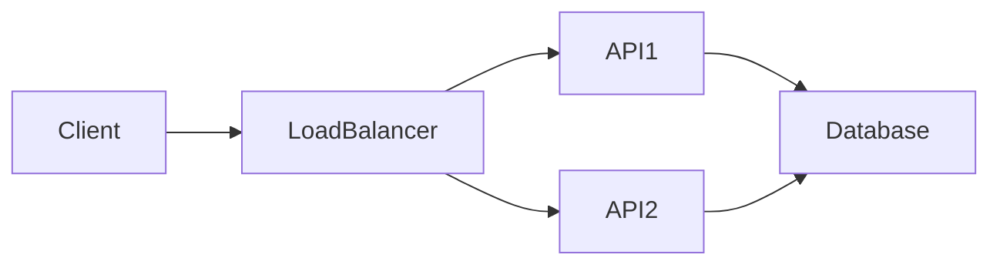

# Technical Blog Post Writing — Texniki Blog Post

## Səviyyə
B1-B2 (portfolio vacib!)

---

## Niyə Vacibdir?

Tech blog post:
- Portfolio göstərir
- İnterview zamanı baxılır
- Personal brand qurur
- Özünü sübut edir
- Skill inkişaf

**Yaxşı blog post = senior engineer imza**

---

## Blog Post Strukturu

```markdown
# Title

## Hook
[1-2 cümlə — niyə oxumalısan]

## Problem / Context
[What are we solving?]

## Solution / Journey
[Main content]

## Code examples
[Real code]

## Results / Lessons
[Outcomes]

## Conclusion
[Summary + next steps]
```

---

## 1. Title — Attention Grabber

### ✓ Good titles

- "How I Reduced API Latency by 90%"
- "The $100K Mistake I Made in Production"
- "Building a Rate Limiter from Scratch"
- "Why We Moved from MongoDB to Postgres"

### ✗ Bad titles

- "My Article"
- "Some Thoughts"
- "Tech Stuff"

### Formulas that work

- **Number + Benefit**: "5 Tips for..."
- **Outcome**: "How I [achieved X]"
- **Story**: "The Bug That Took Down..."
- **Question**: "Why [X] Matters"
- **Contrarian**: "Stop Doing X"

---

## 2. Hook — First 2 Sentences

Reader 5 saniyə qərar verir. Güclü başla.

### Techniques

#### A. Statement

"We had a 2-hour outage last Friday. Here's how we
prevented it from ever happening again."

#### B. Question

"Why does your JavaScript code slow down after 1000
iterations? Spoiler: it's V8."

#### C. Story

"At 3 AM on Friday, my phone buzzed. Our API was
returning 500s..."

#### D. Statistic

"50% of engineers can't explain how HTTPS works.
Let's fix that."

---

## 3. Problem / Context

Reader niyə bu məqaləni oxumalıdır?

### Components

- **What** are we solving?
- **Why** does it matter?
- **Who** is affected?

### Example

```markdown
## The Problem

Our customers started reporting slow dashboard loads.
Investigation revealed **p99 latency** had increased
from 200ms to 2 seconds over 6 months.

This affected **60% of users** and caused a **15% drop**
in engagement.
```

---

## 4. Solution / Journey

Əsas hissə.

### Narrative structure

1. **Hypothesis** — what you thought
2. **Investigation** — what you tried
3. **Discovery** — what you found
4. **Implementation** — what you built
5. **Validation** — how you tested

### Example structure

```markdown
## Investigation

My first hypothesis was database slowness. I checked
query times, but they looked normal (under 50ms).

Then I looked at **code-level profiling**. That's
where I found it: N+1 queries in the serializer.

## Solution

I refactored the serializer to use eager loading:

[code example]

## Validation

After deploying, p99 latency dropped from 2s to 180ms.
```

---

## 5. Code Examples

### Always include real code

```markdown
### Before

```python
# N+1 query problem
users = User.all()
for user in users:
    print(user.orders.count())  # Query per user!
```

### After

```python
# Eager loading
users = User.includes(:orders).all()
for user in users:
    print(len(user.orders))  # No additional queries
```

### Result

- Before: **200 queries** for 200 users
- After: **2 queries** total
```

### Code guidelines

- **Runnable** examples
- **Commented** where non-obvious
- **Highlight** the key change
- **Show before/after** when showing improvements

---

## 6. Visuals

### Add diagrams / charts

- Performance graphs
- Architecture diagrams
- Before/after screenshots
- Flow charts

### Tools

- **Mermaid** (markdown diagrams)
- **draw.io** / **excalidraw**
- **Matplotlib** (Python charts)
- Screenshots with annotations

### Example (Mermaid)



---

## 7. Results / Metrics

Ölçülə bilən nəticə.

### Show impact

```markdown
## Results

- **p99 latency**: 2s → 180ms (11x improvement)
- **User complaints**: 45/day → 3/day
- **Server costs**: reduced by 30% (fewer retries)
- **Engagement**: +15% in dashboard usage
```

### Metrics matter

Readers want to know:
- **How much** better?
- **What cost**?
- **Trade-offs**?

---

## 8. Lessons Learned

Ən dəyərli hissə.

### Format

```markdown
## Key Takeaways

### What I'd do differently

- **Profile early**: we fixed wrong things for 2 weeks
- **Measure first**: we needed baseline metrics
- **Communicate**: share progress with stakeholders

### What surprised me

- **Database wasn't the bottleneck** (assumed it was)
- **Small refactor had big impact**

### General principles

- "Premature optimization is the root of all evil" —
  but so is late optimization.
- Measurement before optimization.
```

---

## 9. Conclusion

Wrap up + call to action.

### Template

```markdown
## Conclusion

By profiling our code and fixing N+1 queries, we
dropped latency from 2s to 180ms — an 11x improvement.

The key lessons:
1. **Profile early**
2. **Measure before optimizing**
3. **N+1 queries are silent killers**

What performance wins have you found? Let me know
in the comments!
```

### Call to action options

- "Share your experience"
- "Check out the repo"
- "Follow me for more"
- "Subscribe to my newsletter"

---

## 10. Voice & Tone

### ✓ Good voice

- **Confident but humble**
- **First person** ("I", "we")
- **Concrete examples**
- **Admits mistakes**
- **Teaches, not brags**

### ✗ Avoid

- Pure bragging
- Too academic
- No personality
- Assuming too much / too little knowledge

### Match audience

- **Junior devs** → explain fundamentals
- **Senior devs** → focus on trade-offs
- **Product / non-tech** → business impact

---

## 11. Post Types

### Tutorial

"How to build X in Y language."
- Step-by-step
- Code-heavy
- Beginner-friendly

### Deep dive

"How [system] works internally."
- Technical
- Diagrams
- For intermediate+

### Post-mortem

"How we fixed [production incident]."
- Story-driven
- Lessons focused
- Transparent

### Opinion

"Why I think X is better than Y."
- Argumentative
- Experience-based
- Controversial (good!)

### Comparison

"X vs Y: Which to choose?"
- Pros/cons
- Use cases
- Recommendations

---

## 12. SEO / Discovery

### Good for search

- **Clear title** with keywords
- **Headings** (H2, H3)
- **Meta description**
- **Tags** / categories
- **Internal links**
- **External references**

### Platforms

- **dev.to** (developer community)
- **Medium** (general)
- **Hashnode** (developer-focused)
- **Personal blog** (full control)
- **Company engineering blog**

---

## 13. Writing Process

### 1. Outline first

- Title
- Headings
- Key points
- Code examples needed

### 2. Draft

- Just write
- Don't edit while drafting
- Get to the end

### 3. Edit

- Cut unnecessary words
- Simplify sentences
- Add examples
- Check flow

### 4. Review

- Read aloud
- Ask a friend
- Check facts / code

### 5. Publish + promote

- Post on Twitter / LinkedIn
- Share in Slack communities
- Respond to comments

---

## 14. Common Mistakes

### ✗ Too long

10,000 words → 1,500 optimal.

### ✗ No hook

First paragraph = essential.

### ✗ No code

Code examples prove you did it.

### ✗ No results

Show metrics / impact.

### ✗ Assumes too much

Explain jargon or link to definitions.

### ✗ Perfection paralysis

Ship it — iterate.

---

## 15. Blog Post Templates

### Template 1: Tutorial

```markdown
# How to Build [X]

## What You'll Learn
- Point 1
- Point 2

## Prerequisites

## Step 1: [Setup]
## Step 2: [Core]
## Step 3: [Polish]

## Conclusion
```

### Template 2: Debug Story

```markdown
# The [Bug] That Took Down [Service]

## The Incident
## The Investigation
## The Fix
## Lessons Learned
```

### Template 3: Opinion

```markdown
# Why [X] Over [Y]

## My Experience
## Pros of X
## Cons of X
## When to Use Y
## Conclusion
```

---

## 16. Interview Context

### Portfolio gem

Interviewers search:
- "[Your name] blog"
- "[Your name] github"

A strong blog post:
- Shows communication skills
- Demonstrates expertise
- Interview talking points

### Reference in interview

- "I wrote a blog post about this..." ✓
- Shows ownership + depth

---

## 17. Content Ideas

### Tech experiences

- Recent bug / incident
- Architecture decision
- New tech learned
- Performance improvement

### Opinions

- Industry trends
- Tool comparisons
- Best practices

### Teaching

- "Things I wish I knew..."
- "X explained simply"
- "Common mistakes in Y"

### Career

- Interview preparation
- Career switches
- Learning journey

---

## Common Phrases

### Openings

- "Last week, we faced..."
- "I've been thinking about..."
- "Let me show you how..."

### Transitions

- "That's why..."
- "Here's the key insight..."
- "Turns out..."
- "It gets better..."

### Technical

- "Under the hood..."
- "The trick is..."
- "The root cause was..."

### Humility

- "I was wrong about..."
- "I learned the hard way..."
- "Initially, I assumed..."

---

## Azərbaycanlı Səhvləri

- ✗ Very long, academic
- ✓ **Conversational**, direct

- ✗ Over-complicated vocab
- ✓ **Clear, simple** language

- ✗ No code
- ✓ **Real code examples**

- ✗ No voice
- ✓ **Personal** perspective

---

## Xatırlatma

**Yaxşı Blog Post:**
1. ✓ Strong title + hook
2. ✓ Clear problem
3. ✓ Real code examples
4. ✓ Visuals / diagrams
5. ✓ Measurable results
6. ✓ Key lessons
7. ✓ Call to action

**Qızıl qaydalar:**
- **1,000-2,000 words** optimal
- **Conversational** tone
- **Specific examples** > general advice
- **Ship it** — perfection paralyzes

**Interview qızıl:** "I wrote a blog post about X..."

→ Related: [pr-descriptions.md](pr-descriptions.md), [technical-writing.md](technical-writing.md), [design-doc-writing.md](design-doc-writing.md)
